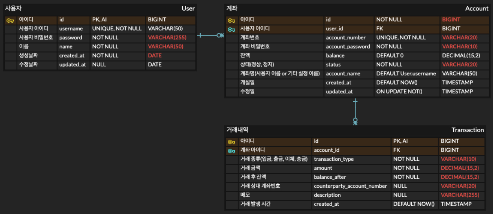

# 💳 계좌 관리 프로젝트

## ✅ 기능 정의

### 1️⃣ 사용자
- 사용자 생성

### 2️⃣ 계좌
- 계좌 개설
- 계좌 조회
  - 전체 계좌 조회
  - 하나의 계좌에 대한 정보 조회
- 계좌 정지
- 계좌 해지

### 3️⃣ 거래
- 입급
- 출금
- 송금
- 거래 내역 조회
  - 최근 날짜 기준 최대 20개의 거래내역 조회
  - 특정 계좌와의 거래에 대한 거래내역 최대 20개 조회

## ✅ ERD 설계



## ✅ 기능 세부 및 API 설계

### 사용자 생성
- API : ```POST /user```
- 파라미터 : 사용자 아이디, 비밀번호, 이름
- 정책 : 사용자 아이디가 존재하는 경우 사용자 생성 실패
- 성공 응답 : 사용자 아이디, 이름, 생성날짜

### 계좌 개설
- API : ```POST /account```
- 파라미터 : 사용자 아이디, 계좌 비밀번호, 초기 잔액, 계좌명
- 정책 : 사용자 아이디가 없는 경우, 계좌가 10개 이상인 경우 실패
- 성공 응답 : 사용자 아이디, 계좌번호, 잔액, 계좌명, 개설일

### 전체 계좌 조회
- API : ```GET /account```
- 파라미터 : 사용자 아이디
- 정책 : 사용자 아이디가 없는 경우 실패
- 성공 응답 : 계좌번호, 잔액, 상태, 계좌명, 개설일

### 하나의 계좌에 대한 정보 조회
- API : ```GET /account```
- 파라미터 : 사용자 아이디, 계좌번호
- 정책 : 사용자 아이디, 계좌번호가 일치하지 않는 경우 실패
- 성공 응답 : 계좌번호, 잔액, 상태, 계좌명, 개설일

### 계좌 정지
- API : ```PUT /account```
- 파라미터 : 사용자 아이디, 계좌번호
- 정책 : 사용자 아이디, 계좌번호가 일치하지 않는 경우, 이미 정지된 경우 실패
- 성공 응답 : 계좌번호, 상태, 계좌명, 수정일

### 계좌 해지
- API : ```DELETE /account```
- 파라미터 : 사용자 아이디, 계좌번호
- 정책 : 사용자 아이디, 계좌번호가 일치하지 않는 경우 실패
- 성공 응답 : 계좌번호, 계좌명

### 입급
- API : ```POST /transaction```
- 파라미터 : 계좌번호, 입금 금액
- 정책 : 계좌번호가 일치하지 않는 경우, 입금금액이 10000원 이하인 경우 실패
- 성공 : 계좌번호, 계좌명, 거래 금액, 거래 후 잔액, 거래 발생 시간

### 출금
- API : ```POST /transaction```
- 파라미터 : 계좌번호, 계좌 비밀번호, 출금 금액
- 정책 : 계좌번호, 계좌 비밀번호가 일치하지 않는 경우 실패
- 성공 : 계좌번호, 계좌명, 출금 금액, 거래 후 잔액, 거래 발생 시간

### 송금
- API : ```POST /transaction```
- 파라미터 : 계좌번호, 계좌 비밀번호, 송금 금액, 송금 대상 계좌번호, 메모
- 정책 : 계좌번호, 계좌 비밀번호가 일치하지 않는 경우, 송금 대상 계좌번호가 일치하지 않는 경우, 송금 대상 계좌가 정지된 경우 실패
- 성공 : 계좌번호, 계좌명, 송금 금액, 거래 후 잔액, 거래 상대 계좌번호, 거래 상대 계좌명, 거래 발생 시간

### 거래 내역 조회(최근 날짜 기준 최대 20개의 거래내역 조회)
- API : ```GET /transaction```
- 파라미터 : 계좌번호, 계좌 비밀번호
- 정책 : 계좌번호, 계좌 비밀번호가 일치하지 않는 경우, 계좌가 정지된 경우 실패
- 성공 : 계좌번호, 잔액, 계좌명, 거래 종류, 거래 금액, 거래 후 잔액, 거래 상대 계좌번호, 거래 상대 계좌명, 거래 발생 시간

### 거래 내역 조회(특정 계좌와의 거래에 대한 거래내역 최대 20개 조회)
- API : ```GET /transaction```
- 파라미터 : 계좌번호, 계좌 비밀번호, 거래 대상 계좌번호
- 정책 : 계좌번호, 계좌 비밀번호가 일치하지 않는 경우, 계좌가 정지된 경우, 거래 대상 계좌번호가 존재하지 않는 경우 실패
- 성공 : 계좌번호, 잔액, 계좌명, 거래 종류, 거래 금액, 거래 후 잔액, 거래 상대 계좌번호, 거래 상대 계좌명, 거래 발생 시간
